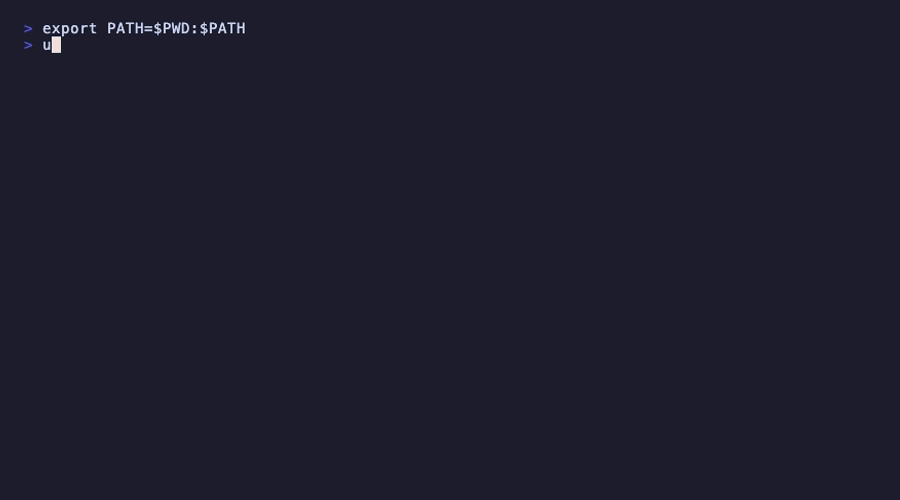

# upkeep

[](https://github.com/teknikqa/upkeep/actions/workflows/ci.yml)
[](https://codecov.io/gh/teknikqa/upkeep)
[](https://go.dev/)
[](LICENSE)
[](https://github.com/teknikqa/upkeep/releases/latest)

A Go CLI tool that keeps your macOS development environment up to date.



## Features

- **15 providers** covering Homebrew, npm/pnpm/yarn/bun, Composer, pip, Rust, uv, editor extensions, Oh My Zsh, Vim, Vagrant, and the Mac App Store — see [Providers](#providers)
- **Scan → Confirm → Execute → Report pipeline** with pterm TUI output
- **Parallel execution** with configurable parallelism and dependency ordering (brew-cask waits for brew)
- **Batched upgrades**: package managers that accept multiple packages (Homebrew, npm, pip) upgrade everything in a single command — faster, and the only way to parallelize Homebrew, whose global lock blocks concurrent processes. A failing batch automatically re-runs each package individually so failures stay isolated. Editor extensions update concurrently across editors.
- **Auth-required cask partitioning**: detects which casks need admin auth via dry-run probe + heuristic fallback; defers them to a separate script
- **Resumability**: JSON state file tracks last-run results; `--retry-failed` re-runs only failed providers
- **Deferred cask script**: `--run-deferred` executes the generated script for auth-required casks
- **YAML config** with per-provider skip lists, auth overrides, and strategy settings — editable via **interactive TUI** or by hand
- **macOS notifications** via `terminal-notifier` (falls back to `osascript`)

## Providers

| Name | Updates | Requires |
|------|---------|----------|
| `brew` | Homebrew formulae | [Homebrew](https://brew.sh) |
| `brew-cask` | Homebrew casks | [Homebrew](https://brew.sh) |
| `npm` | Globally-installed npm packages | `npm` |
| `pnpm` | Globally-installed pnpm packages | `pnpm` — requires `pnpm setup` to have added its global bin dir to `PATH`; otherwise this provider reports 0 outdated |
| `yarn` | Globally-installed Yarn (classic) packages | `yarn` — Yarn Classic has no per-package outdated listing, so this runs a wholesale `yarn global upgrade` |
| `bun` | Globally-installed bun packages | `bun` |
| `composer` | Globally-installed Composer packages | `composer` |
| `pip` | pip3 + pipx packages | `pip3` and/or `pipx` |
| `rust` | Rust toolchains (rustup) and cargo-installed binaries | `rustup`, [`cargo-update`](https://github.com/nabijaczleweli/cargo-update) |
| `uv` | [`uv`](https://docs.astral.sh/uv/) itself and globally-installed `uv tool` packages | `uv` — self-update only works for standalone installs; brew/pip-installed `uv` skips that step |
| `editor` | Installed extensions for VS Code, Cursor, Kiro, Windsurf, and other VS Code–compatible editors | the editor's CLI (`code`, `cursor`, etc.) |
| `mas` | Apps installed from the Mac App Store | [`mas`](https://github.com/mas-cli/mas) (`brew install mas`) — every update needs admin auth; `upkeep` caches sudo credentials once per run rather than prompting per app |
| `omz` | Oh My Zsh itself | Oh My Zsh installed |
| `vim` | Vim plugins (vim-plug or pathogen) | Vim + a supported plugin manager |
| `vagrant` | Vagrant boxes | `vagrant` |

Run `upkeep --list` to see which providers are currently registered, or `upkeep <name> [<name> ...]` to update specific ones (e.g. `upkeep brew npm`). A provider that's missing its required tool is reported as unavailable and skipped rather than erroring.

`npm`/`pnpm`/`yarn` work the same whether installed directly or managed via [Corepack](https://nodejs.org/api/corepack.html) (`corepack enable`) — Corepack shims them onto `PATH` as regular executables, so no special handling is needed. Corepack's default (unpinned) `yarn` resolves to Yarn Classic (1.x), matching what the `yarn` provider expects.

## Installation

### From a release

Download the latest archive from the [releases page](https://github.com/teknikqa/upkeep/releases/latest):

```bash
# macOS Apple Silicon (arm64)
curl -sL https://github.com/teknikqa/upkeep/releases/latest/download/upkeep_$(curl -s https://api.github.com/repos/teknikqa/upkeep/releases/latest | grep tag_name | cut -d '"' -f4 | tr -d v)_darwin_arm64.tar.gz | tar xz

# macOS Intel (amd64)
curl -sL https://github.com/teknikqa/upkeep/releases/latest/download/upkeep_$(curl -s https://api.github.com/repos/teknikqa/upkeep/releases/latest | grep tag_name | cut -d '"' -f4 | tr -d v)_darwin_amd64.tar.gz | tar xz

# Move to a directory in your PATH
sudo mv upkeep /usr/local/bin/
```

### From source

Requires Go 1.25+.

```bash
# Install with go install
go install github.com/teknikqa/upkeep@latest

# Or build from source
make build

# Build and install to ~/bin/upkeep
make install
```

## Usage

```bash
# Update all available providers
upkeep

# Scan only — show what would be updated
upkeep --dry-run

# Update without confirmation prompt
upkeep --yes

# Update specific providers
upkeep brew npm

# Re-run only providers that failed last time
upkeep --retry-failed

# Execute deferred auth-required cask updates
upkeep --run-deferred

# Show full subprocess output on console
upkeep --verbose

# List all available providers
upkeep --list

# Use a custom config file
upkeep --config ~/.config/upkeep/config.yaml
```

### Managing Configuration

```bash
# Launch interactive config editor (TUI)
upkeep config edit

# Print current effective configuration as YAML
upkeep config show

# Print config file path
upkeep config path

# Reset configuration to defaults
upkeep config reset
```

## Configuration

Config file location: `~/.config/upkeep/config.yaml` (auto-created with defaults on first run).

Use `upkeep config edit` to modify settings interactively, or edit the file directly:

```yaml
parallelism: 4

providers:
  brew:
    enabled: true
    skip: []           # packages to skip

  brew_cask:
    enabled: true
    greedy: true
    auth_strategy: defer    # defer | skip | force-interactive
    auth_overrides:
      docker: false         # never requires auth
    rebuild_open_with: true

  npm:
    enabled: true
    skip: []

  # ... other providers follow the same pattern

notifications:
  enabled: true
  tool: terminal-notifier   # terminal-notifier | osascript

logging:
  dir: ~/Library/Logs
  level: info
```

## Auth Strategy for Homebrew Casks

Casks that require admin authentication are handled per the `auth_strategy` config:

| Strategy | Behaviour |
|----------|-----------|
| `defer` (default) | Writes `~/.local/state/upkeep/deferred-cask.sh`; sends macOS notification; run later with `--run-deferred` |
| `skip` | Skips auth-required casks entirely |
| `force-interactive` | Runs brew interactively (prompts for password) |

Auth detection priority: **config override** > **dry-run probe** (`NONINTERACTIVE=1 brew upgrade --cask <name> --dry-run`) > **heuristic** (inspects `brew info` for `.pkg`, `installer`, `launchctl`, etc.)

## State File

State is written to `~/.local/state/upkeep/last-run.json` after each run. It records:
- Per-provider status (`success` / `partial` / `failed`)
- Lists of updated / failed / deferred / skipped packages
- Deferred cask script path
- Run timestamp and duration

## Development

```bash
# Run all tests
make test

# Run tests with coverage report
make coverage

# Lint (go vet + golangci-lint)
make lint

# Format code
make fmt

# Run full CI pipeline locally (fmt, lint, test, build)
make ci

# GoReleaser dry-run
make release-dry-run

# Tidy dependencies
make tidy
```
